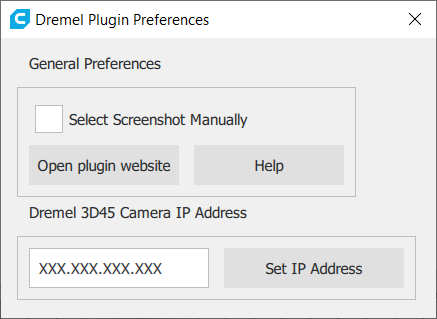
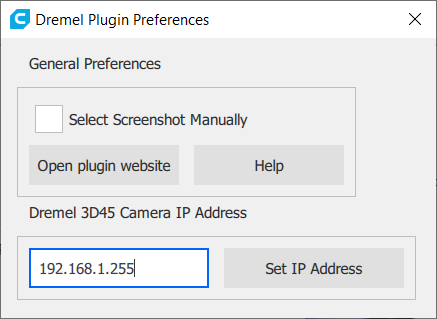
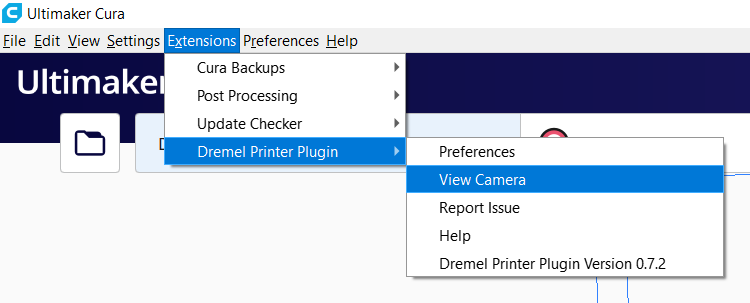
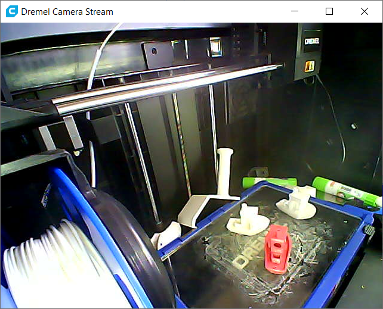
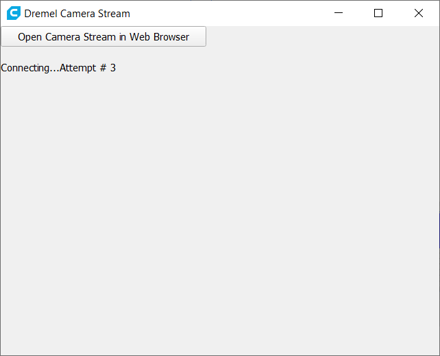

# Cura-Dremel-Printer-Plugin

https://github.com/timmehtimmeh/Cura-Dremel-Printer-Plugin/

This is a plugin for [Cura version 4.4 and onward](https://ultimaker.com/en/products/ultimaker-cura-software) that adds the Dremel Ideabuilder 3D20, 3D40<sup>[*FAQ1](#FAQ)</sup>, and 3D45 printer to Cura and enables Cura to export to the proprietary Dremel .g3drem file format.

# <a name="Table_Of_Contents"></a>Table Of Contents
- [Introduction](#Introduction)
- [Installation Instructions](#Installation)
- [Using the Plugin](#Using_the_Plugin)
- [Preview Image Options](#Preview_Image_Options)
- [Dremel 3D45 Camera](#Dremel_3D45_Camera)
- [Current State of the Settings](#MaterialSettings)
- [Note](#Note)
- [Frequently Asked Questions (FAQ)](#FAQ)
- [Technical Details of the .g3drem File Format](#Technical_Details)
- [Contributors](#Contributors)
- [License](#License)

# <a name="Introduction"></a>Introduction
This software is released as a plugin for the [Ultimaker Cura](https://ultimaker.com/en/products/ultimaker-cura-software) Software.  The Cura-Dremel-Printer-Plugin contains the necessary printer files to add the Dremel IdeaBuilder 3D20, 3D40<sup>[*FAQ1](#FAQ)</sup>, and 3D45 printers to Cura and enables Cura to export the proprietary g3drem file format.

The author of this software is not affiliated with Dremel, or Bosch Industries, or Ultimaker.  Although the software functions well for the author and many other users, it is released without guarantee.  Using the software and the files that it produces may damage your printer, set property on fire, or do other **really_bad_things**.  

This software is supplied without warranty and the user is responsible if they use this software and injury happens to their person or any other persons or damage occurs to any property as a result of using this software and/or the files that it creates.  Please remain near the 3D printer while using files generated by this software, and pay close attention to the 3D printer while it is on to verify that the machine is functioning properly. The software is provided AS-IS and any usage of this software or its output files is strictly at the user's own risk. The developer makes no other warranties, express or implied, and hereby disclaims all implied warranties, including any warranty of merchantability and warranty of fitness for a particular purpose.

The code for this plugin is based upon the [Cura gcode writer plugin](https://github.com/Ultimaker/Cura/tree/master/plugins/GCodeWriter) and is released under a LGPL-3.0 license.  Source code for this plugin can be found [here](https://github.com/timmehtimmeh/Cura-Dremel-Printer-Plugin).


This plugin is available within the Cura marketplace.  Users are encouraged to use the built-in Cura Marketplace to install & update this plugin rather than downloading the plugin directly from the releases page.  

**Note:**  For older versions of Cura, please read the table below to find the correct version:

| Cura Version | Last version of the 3D20 plugin that works with the version of Cura         | Supported Printers |
|--------------|------------------------------------------------------------------------|-----|
5.0 | [version 0.8.0](https://github.com/timmehtimmeh/Cura-Dremel-Printer-Plugin/releases/tag/0.7.3) | 3D20, 3D40<sup>[*FAQ1](#FAQ)</sup>, 3D45|
4.4 through 4.13.1 | [version 0.7.2](https://github.com/timmehtimmeh/Cura-Dremel-Printer-Plugin/releases/tag/0.7.2) | 3D20, 3D40<sup>[*FAQ1](#FAQ)</sup>, 3D45|
3.5 through 4.3  | [version 0.5.9](https://github.com/timmehtimmeh/Cura-Dremel-3D20-Plugin/releases/tag/0.5.9) | 3D20 |
3.4 or 3.4.1   | [version 0.4.8](https://github.com/timmehtimmeh/Cura-Dremel-3D20-Plugin/releases/tag/0.4.8) | 3D20 |
3.3 or 3.3.1   | [version 0.4.3](https://github.com/timmehtimmeh/Cura-Dremel-3D20-Plugin/releases/tag/0.4.3) | 3D20 |
3.2 or 3.2.1   | [version 0.4.2](https://github.com/timmehtimmeh/Cura-Dremel-3D20-Plugin/releases/tag/0.4.2) | 3D20 |
3.0 or 3.1     | [version 0.2.5](https://github.com/timmehtimmeh/Cura-Dremel-3D20-Plugin/releases/tag/0.2.5) | 3D20 |

---

# <a name="Installation"></a>Installation

To install the plugin, follow the instructions below:

1.  [Download and install Cura](https://ultimaker.com/en/products/ultimaker-cura-software) on your machine.  This plugin has been tested on Windows 10 Professional 64 bit edition, MacOS 10.12 (Sierra), and Ubuntu 20.04 LTS, but this plugin should work equally well on any other operating system that Cura supports.

2.  Open Cura, select the Marketplace menu, then select the "Browse Packages" item.  Cura will bring up the package browser.  Find the "Dremel-Plugin" package in the list, then click install.

    

3. Cura will display a message window telling you to restart Cura.
    

4.  Close the Cura application and re-launch Cura.

5.  Upon restart you should have an option to add a Dremel3D20, Dremel3D40<sup>[*FAQ1](#FAQ)</sup>, and Dremel3D45 printer (see "Using the Plugin" section below) - Congratulations, the plugin is now installed!

**Note For users of the older Dremel3D20 plugin**:  This plugin replaces the older Dremel3D20 plugin.  It contains the necessary files to install and use a 3D20.  Any updates to the 3D20 printer will be made in this plugin.  Users should uninstall the old Dremel3D20 plugin once this plugin is installed.  This plugin will try to detect if the older Dremel3D20 plugin is installed and provide a message prompting you to uninstall the 3D20 plugin.

---
# <a name="Using_the_Plugin"></a>Using the Plugin
Once the plugin has been installed you can use it by following the steps outlined below:
1. Open Cura & load an object that you want to print

2. Select the Dremel3D20, Dremel3D40, or Dremel4D45 as your printer (preferences->configure cura->printers->add)


3. Select the type of filament you're using in your printer.  By default the 3D20 and 3D40 use the **Dremel PLA** filament, and the 3D45 uses the **Dremel ECO ABS** filament.  These filament definitions are included and installed with the plugin.


4. Set the slicing options that you want from the print settings in the upper right corner of the screen.


5. Press the slice button in the lower-right corner to tell Cura to slice the object using the selected settings.


6. Click the "save to file" or "save to removable drive" button.  Ensure that .g3drem is chosen as the output file format.


The plugin selects the embedded image based on the logic outlined in the [Preview Image Options](#Preview_Image_Options) section below.

7. Save this file to a removable drive (SD card for the 3D20, USB thumbdrive for the 3D40 & 3D45)
8. Insert the removable drive card into your Dremel 3D printer
9. Turn on the printer
10. Select the appropriate file to print.  
11. Click print on the 3D Printer
12. Enjoy - if you encounter issues, feel free to raise them in the ["Issues" section](https://github.com/timmehtimmeh/Cura-DremelPrinterPlugin/issues/new).
---

# <a name="Preview_Image_Options"></a>Preview Image Options
The plugin has implemented the following logic for selecting a preview image that will show up on the Dremel screen.  The thick green line follows the default options which are selected at plugin installation.  To deviate from the default options you must intervene as outlined in the text below:


1. The plugin has an option to allow the user to select an image file manually for use as the preview on the Ideabuilder screen.  To enable this feature, go to the Extensions menu, and select Dremel Printer Plugin->preferences and check the box next to the text that reads "Select Screenshot Manually."



Cura will then pop up a message stating that screenshot selection is enabled


To disable this feature after enabling it, simply click the "Toggle Screenshot Selection" menu item again, and a message will state that the screenshot selection is disabled.

After enabling manual selection, once the user selects a location to save the .g3drem file out a secondary file selection menu will be brought up allowing the user to select a screenshot.  If an image file is selected then it will be used, if the cancel button is pressed then the plugin will skip Step 2 and proceed to Step 3


2. If manual screenshot selection is disabled, then the plugin searches the directory where the user saves the .g3drem file for an image file with the same name.  If no valid image file with the same name is found in the same directory, then the plugin proceeds to Step 3.  Valid image extensions are .png, .jpg, .jpeg, .gif, and .bmp.  

```
For example if the user saves llama.g3drem to the desktop and the desktop folder
has a llama.jpg image file within it then the llama.jpg file will be used as the
preview image on the Dremel:
```


([llama photo](https://en.wikipedia.org/wiki/Llama#/media/File:Llama_lying_down.jpg) by Johann "nojhan" Dréo, distributed under a CC BY-SA 2.0 FR license.)


3.  If a screenshot has not been found after steps 1 and 2, then the plugin attempts to take a screenshot of the main Cura window and save it to the file.  This is the default behavior of the plugin, and is what will happen normally if the user doesn't perform the actions listed in Steps 1 and 2.

4.  If the screenshot fails for some reason then the plugin's icon will be selected as the preview image.

---
# <a name="Dremel_3D45_Camera"></a>Dremel 3D45 Camera
The Dremel 3D45 is equipped with a camera that can be used to monitor the printer.  In order to use the camera with this plugin follow the instructions below:
1.  Determine the IP address of the Dremel3D45 by turning on the printer and clicking on Tools->About.  The IP address of the printer will be displayed on the screen.

2.  Open the Preferences dialog and enter the IP address of the printer and press enter or the "Set IP Address" button 



3.  A message should be displayed on the main Cura window


4.  Open the plugin's menu page and select "View Camera"



5.  A new window should be displayed showing the camera view.



**Troubleshooting Camera Connections:**
1.  While the camera window is open the plugin will try to connect to the camera at the IP address that was set.  While the plugin is connecting the window shows the number of attempts that it has made to connect to the camera stream, along with a button that allows you to open the website that the Dremel is using to connect to the camera.  If connection fails, click the button and a web browser will be opened allowing the user to try to connect to the Dremel via the browser.  If the browser cannot connect, then the plugin will not be able to connect either.  Check that the printer is on, that the printer's IP address is set correctly in the plugin, and that the computer is on the same network as the printer.



---
# <a name="MaterialSettings"></a>Current State of the Settings
Currently the medium quality (0.2mm layer height) produces the following prints with the 3D Benchy.  There is still room for improvement (especially retraction settings with nylon) and work is being done to improve them. Suggestions for updates to the settings would be welcome.

| Material  | Printer | Image of print at "Medium" quality|
| ------------- | ------------- | ------------- |
| Dremel PLA (0.75kg spool) | 3D45 |   |
| Dremel PLA (0.5kg spool) | 3D45 |   |
| Dremel ECO ABS | 3D45 |   |
| Dremel Nylon | 3D45 |   |
| Dremel PETG | 3D45 |   |
| Dremel PLA (0.75kg spool) | 3D20 |  |
| Dremel PLA (0.5kg spool) | 3D20 |  |

*Note* - Printing with PETG at ultra quality has a low likelihood of success.  The Plugin will warn the user if they choose to save a .g3drem file when the Dremel PETG material is selected and "Ultra" quality is chosen.


---
# <a name="Note"></a>Note
Please note the following:
* The plugin has been tested using the latest version of Cura noted in this README on Windows 10 x64.  Prior versions have been tested on MacOS Sierra (MacOS 10.12), MacOS El Capitan (10.11), and Ubuntu versions 21.04.  Testing on non-Windows platforms occurs much less frequently than on Windows.  If you are using another platform and encounter issues with the plugin, feel free to [raise an issue](https://github.com/timmehtimmeh/Cura-Dremel-Printer-Plugin/issues/new).
* This plugin has been tested to work in the basic print case, however users may still encounter problems with the print head crashing into your parts if you attempt to print multiple parts on the same print bed one-after-another instead of printing them all-at-once.

---
# <a name="OtherRepos"></a>Other Interesting Repositories for Dremel 3D Printer Users
1.  [Dremel3D Upload Plugin](https://github.com/lwerner-lshigh/Dremel3D-CuraPrintr) - Enables uploading Cura generated gcode directly to the 3D40 & 3D45
2.  [Flashforge marlin firmware](https://github.com/moonglow/FlashForge_Marlin) - Enables the user to update the 3D20 to Marlin firmware

---
# <a name="FAQ"></a>Frequently Asked Questions
1. **Question:** *I have a problem with this plugin and my Dremel 3D40*
   **Answer:**   The author doesn't own and doesn't have access to a 3D40 - the 3D40 is included with this plugin in an untested state, and should be considered experimental (hence the asterisks).  Feel free to raise an issue in the ["Issues" section](https://github.com/timmehtimmeh/Cura-Dremel-Printer-Plugin/issues/new), but without access to a 3D40 support for it will be somewhat limited.  Feedback or pull requests to improve the default settings for the 3D40 (or any of the printers) would be most welcome.

2. **Question:** *Does this plugin support USB-connected printing/Octoprint/Cloud Printing?  Do I need an SD card/USB thumb drive?*
   **Answer:** The plugin only supports creating .g3drem files and using a removable drive (SD Card/USB drive) to get the files into the printer.  It does not currently support direct USB or WiFi/Cloud communication with the printer.  For 3D40/3D45 users, the [Dremel3D Upload Plugin](https://github.com/lwerner-lshigh/Dremel3D-CuraPrintr) works to upload .gcode (not .g3drem) files to the machine given an IP address.  For advanced users who own a 3D20 Octoprint can be enabled by following [these instructions](docs/octoprint/README.md).

3. **Question:** *I'm using an older version of Cura and I can not find the plugin in the Ultimaker Cura marketplace*
   **Answer:** Unfortunately the marketplace only allows one version of the plugin to exist at the time.  As Ultimaker updates Cura they occasionally break compatibility with older versions of plugins.  Users are encouraged to [update to the latest version of Cura](https://ultimaker.com/software/ultimaker-cura) and download the latest version of the plugin from the marketplace.  If a user is tied to a specific version of Cura then they can download & manually install older releases of the plugin [here](https://github.com/timmehtimmeh/Cura-Dremel-Printer-Plugin/releases)

4. **Question:** *The default settings for this plugin don't work with my printer*
  **Answer:**  The author has tested the settings for the Dremel materials (Dremel PLA, Dremel Nylon, Dremel PETG, Dremel Eco-ABS) and the settings work reasonably well on the 3D20 and 3D45 printers (notable exception - printing with Dremel PETG on Ultra quality doesn't work)  If you have any suggested improvements to the settings please submit a Github issue or Pull Request and the changes will get tested.


---
# <a name="Technical_Details"></a>Technical Details of the .g3drem File Format
The g3drem file format consists of a few sections.  The header is a mix of binary data and ASCII data, which is followed by an 80x60 pixel bitmap image written to the file, which is then followed by standard 3d printer gcode saved in ASCII format.

**An Example of the binary header looks like this:**


A description of the current understanding of this file format is below:

| Binary Data                                     | Description                                                          |
|-------------------------------------------------|----------------------------------------------------------------------|
`67 33 64 72 65 6d 20 31 2e 30 20 20 20 20 20 20` | Ascii for 'g3drem 1.0      '               (See 1 below )            |
`3a 00 00 00 b0 38 00 00 b0 38 00 00 38 04 00 00` | Memory Locations #s and Time(sec)          (See 2 through 5 below )  |
`8f 04 00 00 00 00 00 00 01 00 00 00 19 00 03 00` | Filament(mm), Flags, Height, Infill, Shell (See 6 through 11 below)  |
`64 00 00 00 DC 00 00 00 01 ff [80x60 Bmp image]` | Speed, Temps, Material and BMP             (See 12 through 18 below) |
`[standard 3d printer gcode]`                     | Gcode in ASCII                             (See 19 below)            |

**The sections of the file are:**
1. `67 33 64 72 65 6d 20 31 2e 30 20 20 20 20 20 20` = ASCII text 'g3drem 1.0      '
2. `3a 00 00 00` = four-byte little-endian uint containing the offset in the file to the start of the thumbnail
3. `b0 38 00 00` = four-byte little-endian uint containing the offset in the file to the start of a large image
4. `b0 38 00 00` = four-byte little-endian uint containing the offset in the file to the start of the gcode
5. `38 04 00 00` = four-byte little-endian uint containing the number of seconds that the print will take
6. `8f 04 00 00` = four-byte little-endian uint containing the estimated number of millimeters of filament that the right extruder will use
7. `00 00 00 00` = four-byte little-endian uint containing the estimated number of millimeters of filament that the left extruder will use (always zero for Ideabuilder3D20)
8. `01 00` = two-byte little-endian ushort that consists of boolean OR-ed flags: 0x01=right extruder, 0x02=left extruder, 0x04=bed heating, 0x08=support enabled
9. `00 00` = A two-byte little-endian ushort number that contains the layer height in micrometers
10. `19 00` = A two-byte little-endian ushort number that contains the infill percentage
11. `03 00` = A two-byte little-endian ushort number containing the number of shell layers
12. `64 00` = A two-byte little-endian ushort number containing the print speed
13. `00 00` = A two-byte little-endian ushort number containing the platform temperature
14. `DC 00` = A two-byte little-endian ushort number containing the right extruder temperature
15. `00 00` = A two-byte little-endian ushort number containing the left extruder temperature. (always zero for Ideabuilder3D20)
16. `01` = A one byte unsigned number containing the material for the right extruder.  0 is ABS, 1 is PLA, 2 is dissolvable material, 15 is no material (Always 1 for Ideabuilder 3D20)
17. `ff` = A one byte unsigned number containing the material for the left extruder.  0 is ABS, 1 is PLA, 2 is dissolvable material, 15 is no material (Always 15 for Ideabuilder 3D20)
18. A bitmap containing the preview image that the Dremel 3D20 will use to display on the screen (See the [usage instructions](#Using_the_Plugin))  This plugin uses an image of size 80x60 pixels for the preview image, and automatically rescales user-selected and screenshot images to be 80x60.
19. Standard 3d printer gcode (Marlin flavor)

---
# <a name="Contributors"></a>Contributors
Many thanks to the following users, who have contributed to the plugin in various ways:
* [metalman3797](https://github.com/metalman3797)
* [Rally037](https://github.com/Rally037)
* [Ghostkeeper](https://github.com/Ghostkeeper)
* [eduncan911](https://github.com/eduncan911)
* [WeavingColors](https://github.com/WeavingColors)
* [SwapFaceL](https://github.com/SwapFaceL)
* [blablaaddi](https://github.com/blablaaddi)
* [Swizzler121](https://github.com/Swizzler121)
* [Appesteijn](https://github.com/Appesteijn)
* [LipuFei](https://github.com/LipuFei)
* [diegopradogesto](https://github.com/diegopradogesto)
* Tijs Kooij
* [takacsa](https://github.com/takacsa)
* [lenigma1](https://github.com/lenigma1)
* The rest of the engineering team at [Ultimaker](https://ultimaker.com/)

---
# <a name="License"></a>License
The Cura-Dremel-Printer-Plugin is licensed under the GNU Lesser General Public License v3.0

Permissions of this copyleft license are conditioned on making available complete source code of licensed works and modifications under the same license or the GNU GPLv3. Copyright and license notices must be preserved. Contributors provide an express grant of patent rights. However, a larger work using the licensed work through interfaces provided by the licensed work may be distributed under different terms and without source code for the larger work.

For the complete license text, please see the [LICENSE file](https://github.com/timmehtimmeh/Cura-Dremel-Printer-Plugin/blob/stable/LICENSE)
